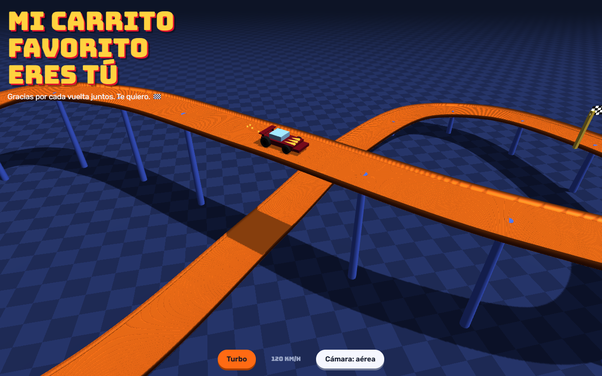

# Pista para ti 🏁

Una dedicatoria animada en 3D: un carrito rojo da vueltas por una pista naranja estilo Hot Wheels, con un mensaje de cariño encima.

**Verla aquí:** https://niurkavane11.github.io/pista-para-ti/



## Qué tiene

- Pista 3D con curvas, subidas y bajadas, sobre un piso de cuadros.
- El carrito acelera en las bajadas y frena en las subidas; el velocímetro lo muestra en km/h.
- **Turbo:** botón para que el carrito vaya más rápido por unos segundos.
- **Cámara:** cambia entre la vista de piloto (detrás del carrito) y la vista aérea.
- Se adapta a computadora y celular.

## Cambiar el mensaje

El texto está en `index.html`, dentro de:

```html
<h1 id="msg">Mi carrito favorito eres tú</h1>
<p id="sub">Gracias por cada vuelta juntos. Te quiero. 🏁</p>
```

Cámbialo, guarda y vuelve a abrir la página.

## Abrirla en tu computadora

No necesita instalar nada. Descarga `index.html` y ábrelo en el navegador (hace falta conexión a internet para cargar Three.js y las fuentes).

```bash
git clone https://github.com/NiurkaVane11/pista-para-ti.git
```

## Tecnología

HTML, CSS y JavaScript en un solo archivo, con [Three.js](https://threejs.org) (r128) para el 3D. Tipografías [Bungee](https://fonts.google.com/specimen/Bungee) y [Rubik](https://fonts.google.com/specimen/Rubik).
